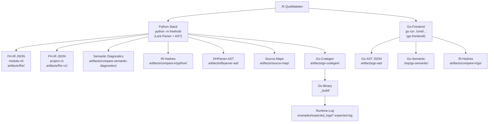
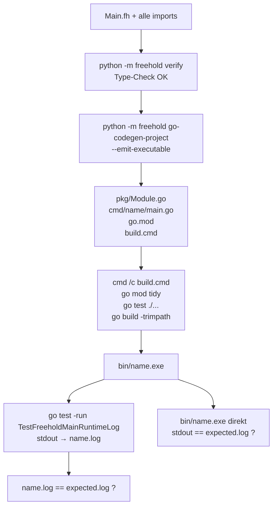
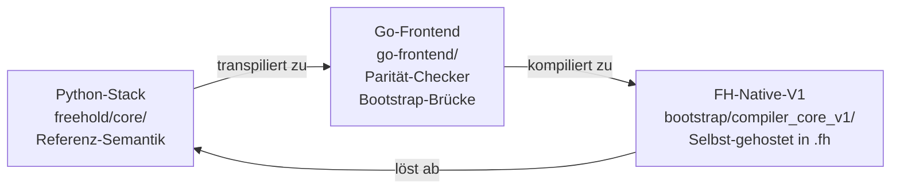

# Freehold — Architektur- und Test-Pfad-Analyse (Stand: 2026-06-18)

Dieses Dokument fasst die vollständige Session-Analyse des Freehold-Projekts zusammen:
Input-Pfade, Compiler-Stacks, Output-Formate, Compare- und Verifikations-Schicht,
EXE-Erzeugung sowie die strategische Rolle von Python- vs. Go- vs. FH-Native-Stack.

---

## 1. Input-Quellen (FH-Dateien)

| Kategorie | Pfad | Beschreibung |
|---|---|---|
| **Language Modules** | `tests/language_modules/` (01–24) | Einzel-.fh-Dateien für Kern-Sprach-Features |
| **Language Modules v2.3** | `tests/language_modules_v2_3/` (01–15) | Erweiterte Features (Subtypen, Generics, Maps, …) |
| **Language Modules 02** | `tests/language_modules_02/` (00–18) | Semantik-fokussierte Einzel-Tests |
| **GNATprove-Module** | `tests/language_modules_gnatprove/` (01–14) | Formale Verifikation (SPARK/Ada) |
| **Compiler-V1-Examples** | `examples/compiler_v1/` (01–46) | Multi-Modul-Projekte (App/Main.fh Entry) |
| **Demo-Files** | `examples/*.fh` | hello_cli, BigNumbers, banking_records, … |

---

## 2. Compiler-Stack-Pipelines



---

## 3. Compare-Schicht

| Script | Input | Vergleichs-Logik | Output |
|---|---|---|---|
| `compare-fhir.cmd` | Python → FHIR-IR | Python FHIR vs. **Baseline** `artifacts/fhir/` | `artifacts/compare-fhir/_summary.json` |
| `compare-fhir-v1.cmd` | Python → FHIR project-v1 | Python FHIR vs. **Baseline** `artifacts/fhir-v1/` | `artifacts/compare-fhir-v1/` |
| `compare-fhir-language-modules.cmd` | `tests/language_modules/` | Python FHIR (stable cases) vs. Baseline | `artifacts/compare-fhir-language-modules/` |
| `compare-ir.cmd` | `artifacts/fhir-samples/` | **Python IR-Hash == Go IR-Hash** | `artifacts/compare-ir/report/` |
| `compare-ir-compiler-v1.cmd` | compiler_v1 manifest | Python IR vs. Go IR + je Baseline | `%TEMP%/…/report/` |
| `compare-ast-shape.cmd` | language_modules | Go-AST Shape | `artifacts/compare-ast-shape/` |
| `compare-ast-semantic.cmd` | go-ast + dhparser-ast | Go-AST vs. DHParser-AST | `artifacts/compare-ast-semantic/` |
| `compare-semantic-diagnostics.cmd` | language_modules | Python-Diag. vs. `expected_semantic_diagnostics.json` | `artifacts/compare-semantic-diagnostics/` |
| `compare-fhir-determinism.cmd` | fhir-samples | Wiederholter Python-Lauf → JSON-Deterministik | `artifacts/compare-fhir-determinism/` |

---

## 4. Verifikations-Schicht

| Script | Stack | Methode |
|---|---|---|
| `verify-go-semantic-diagnostics.cmd` | **Go** | `go run ./cmd/go-parse-tests-language-modules --semantic` → `.tmp/go-semantic/` → `verify_go_semantic_diagnostics.py` vs. `expected_go_semantic_diagnostics.json` |
| `verify-go-semantic-diagnostics-v2_3.cmd` | **Go** | Gleich, aber `tests/language_modules_v2_3/` |
| `verify-go-semantic-projects.cmd` | **Go** | `go run ./cmd/go-semantic-project` → `.tmp/go-semantic-project/` vs. `expected_go_semantic_projects.json` |
| `verify-go-feature-matrix.cmd` | **Go** | Go-Codegen feature matrix vs. `go_codegen_feature_matrix.json` |
| `verify-language-modules-v2_3.cmd` | **Python** | `python -m freehold test-language --root tests/language_modules_v2_3` |
| `verify-compiler-examples.cmd` | **Python + Go** | `verify_compiler_examples.py`: Python parse → Go-Codegen → `go build` → `go run` → Runtime-Log vs. `expected_logs/` |
| `verify-stage3-compiler-core-v1.cmd` | **Python** | Stage-3 Compiler-Core-Contracts via `artifacts/stage3/compiler_core_v1/manifest.json` |
| `verify-stage3-compiler-examples.cmd` | **Python + Go** | `verify_stage3_compiler_on_examples.py` |
| `verify-spec-diagnostics.cmd` | **Python** | Spec-Diagnostik-Prüfung `artifacts/verify-spec-diagnostics/` |
| `fhverify.ps1` | **Python** | `python -m freehold verify <file.fh>` (Semantik-Prüfung einzelner Dateien) |

---

## 5. EXE-Erzeugung aus Examples — die vollständige Kette

### Schritt 1 — Semantik-Prüfung (Python)
```
python -m freehold verify examples/compiler_v1/01_minimal_app/App/Main.fh
```
Lark-Parser → AST → Type-Check. Schlägt das fehl, bricht der Build sofort ab.

### Schritt 2 — Go-Codegen (Python → Go-Quelltext)
```
python -m freehold go-codegen-project App/Main.fh
    --output-dir  .tmp/compiler_examples/01_minimal_app/
    --json        .tmp/compiler_examples/01_minimal_app/_project.json
    --emit-executable
    --executable-name  01_minimal_app
```

Der Python-Stack traversiert den Modul-Graph (alle `.fh`-Imports) und schreibt:

| Datei | Inhalt |
|---|---|
| `<package>/<Module>.go` | Generierter Go-Paket-Code pro FH-Modul |
| `cmd/01_minimal_app/main.go` | `package main` + `func main()` → ruft `Main()` auf; enthält Blank-Imports für gRPC-Registratoren |
| `go.mod` | Module-Pfad + `replace`-Direktiven auf `vendor-go/` |
| `build.cmd` / `build.sh` | Generiertes Build-Script |

### Schritt 3 — Go-Build (erzeugt die EXE)
```
cmd /c build.cmd
```
Das generierte `build.cmd` tut exakt:
```batch
go mod tidy
go test ./...
go build -trimpath -o bin\01_minimal_app.exe .\cmd\01_minimal_app
```
Output: `.tmp/compiler_examples/01_minimal_app/bin/01_minimal_app.exe`

### Schritt 4 — Runtime-Log-Verifikation
Falls `expected_log` definiert ist:
```
go test ./... -run TestFreeholdMainRuntimeLog -count=1
```
Ein **generierter** Go-Testfile (`freehold_runtime_log_test.go`) capturt `stdout` via `os.Pipe()`
und schreibt das Log. Dann:
```
actual log  ==?  examples/expected_logs/01_minimal_app.expected.log
```
Zusätzlich wird die fertige EXE direkt ausgeführt und ihr stdout erneut gegen das `expected.log` verglichen.

### Gesamtablauf visuell



**Kurzweg über CLI (ohne Test):**
```
python -m freehold build-exe examples/compiler_v1/01_minimal_app/App/Main.fh
```

---

## 6. Referenz-Compiler: Python-Stack

### Warum Python die Referenz ist

Aus `STRATEGIE.md` (Grundsatz):

> *„Die Freehold-Seite ist die Referenz für die Sprache. Die Frage ‚Was bedeutet Freehold?' wird im Freehold-Core beantwortet."*

Der Python-Stack (`freehold/core/`) enthält:
- **Parser** (Lark)
- **AST + Type-Checker** (`ast.py`, `TypeCheckError`)
- **Verifier / Semantik-Analyse** (`verifier.py`)
- **Diagnostics** (die definierende Quelle für alle Fehlercodes)
- **FH-IR / FHIR-Exporter** (kanonisches IR-Format)
- **Go-Codegen** (Transpiler Python → Go-Quelltext)

### Rolle des Go-Stacks

Der Go-Frontend (`go-frontend/`) ist **kein Referenz-Compiler**, sondern:

| Rolle | Beschreibung |
|---|---|
| **Parität-Kandidat** | Muss dieselben AST-Shapes und Diagnosen wie Python liefern |
| **Performance-Frontend** | Schnellerer Parser für IDE/LSP |
| **Verifikations-Brücke** | `go-semantic-project`, `go-parse-tests-language-modules` |
| **Bootstrap-Brücke** | Transpiliert FH-Native-V1 in lauffähige EXE |

### Die Korrektheits-Invariante

```
Python-IR-Hash  ==  Go-IR-Hash
```

Wenn diese Gleichheit bricht, ist der **Go-Stack falsch** — nicht Python.
Python definiert das Soll, Go muss folgen.

---

## 7. Ablösung: Python → FH-Native-V1

### Die drei Stacks und ihre Rollen



### Phasen-Modell

| Phase | Python | Go-Frontend | FH-Native-V1 |
|---|---|---|---|
| **Heute** | Referenz | Parität-Check | wächst |
| **Port-Phase** | Referenz | Parität-Check | Verifier-Ports laufen |
| **Final Gate** | dekommissioniert | Parität-Check gegen FH-Native | neue Referenz |

### Bedingungen für Python-Ablösung (`TODO-NEXT-V1.md`)

```
Bedingung 1:  EBNF-Freeze  (Syntax eingefroren in Freehold.ebnf)
Bedingung 2:  FH-Native Verifier.fh erhält alle 7 Verifier-Ports (siehe unten)
Bedingung 3:  stage3_compiler_core_v1.exe kompiliert sich selbst byte-identisch  ✅ erreicht
Bedingung 4:  CLI build-exe hardening
Bedingung 5:  Cross-Platform .sh Scripts
```

### Jede neue Sprachfunktion muss zuerst in Python implementiert werden

1. Python `verifier.py` / `go_codegen.py` bekommt das Feature
2. Tests in `tests/language_modules/` werden grün gegen Python
3. FH-IR-Baseline wird in `artifacts/fhir/` geschrieben
4. Go-Frontend portiert nach (Parität-Check)
5. FH-Native `Verifier.fh` portiert nach (Bootstrap-Ziel)

---

## 8. Stand der 7 Verifier-Ports in `Verifier.fh`

`bootstrap/compiler_core_v1/Compiler/Core/Verifier.fh` — 752 Zeilen (Stand 2026-06-18)

| # | Feature | Funktion in `Verifier.fh` | Implementierungs-Status |
|---|---|---|---|
| 1 | Taint-Tracking (depends) | `check_depends_validity(...)` | ✅ Code vorhanden |
| 2 | Transitive Globals-Propagation | `check_transitive_globals(...)` | ✅ Code vorhanden |
| 3 | Static Anti-Aliasing | `check_anti_aliasing(...)` + `get_root_var_name(...)` | ✅ Code vorhanden |
| 4 | Field-Level Dependency Tracking | `get_root_var_name` mit Dot-Pfad-Auflösung | ✅ Code vorhanden |
| 5 | Quantified Arrays (`for all`/`for some`) | `FOR_ALL` / `FOR_SOME` in `expr_to_smt(...)` | ✅ Code vorhanden |
| 6 | Channel Invariants | `verify_channel_invariant(...)` + `build_spawn_precondition_smt_query(...)` | ✅ Code vorhanden |
| 7 | WhyML Code-Generation | eigene Datei `WhyMLCodeGen.fh` | ✅ Code vorhanden |

**Hinweis:** Der Code ist implementiert. Was `TODO-NEXT-V1.md` als offen listet, bezieht sich
auf die **vollständige Integration und Conformance-Test-Abdeckung** dieser Funktionen
im laufenden Bootstrap-Compiler-Kern — nicht auf das Fehlen der Logik selbst.

---

## 9. Zusammenfassung der vollständigen Test-Kette

```
.fh Quelldatei(en)
   │
   ├─► [Python-Stack]  python -m freehold
   │       ├── Lark-Parser → AST → Type-Check → FH-IR (FHIR JSON)
   │       ├── Semantic Diagnostics (compare-semantic-diagnostics)
   │       ├── IR-Hash Export  (compare-ir)
   │       └── Go-Codegen → .go Quellcode → go build → Executable
   │                                              └── Runtime-Log vs. expected_logs/
   │
   ├─► [Go-Frontend]   go run ./cmd/go-parse-tests-*
   │       ├── Go-AST JSON  (compare-ast-shape / compare-ast-semantic)
   │       ├── Go-Semantic JSON  (verify-go-semantic-diagnostics)
   │       ├── Go-Semantic-Project  (verify-go-semantic-projects)
   │       └── IR-Hash Export  (compare-ir ↔ Python IR-Hash)
   │
   └─► [GNATprove]  tests/language_modules_gnatprove/
           └── SPARK-Ada formale Verifikation (verify_program)
```

**Kern-Invariante:** Alle IR-Hash-Compare-Scripts prüfen, dass Python-Stack und Go-Frontend
für dieselbe Quelle identische Hashes produzieren — das ist das Hauptkorrektheitskriterium
der dualen Architektur.
