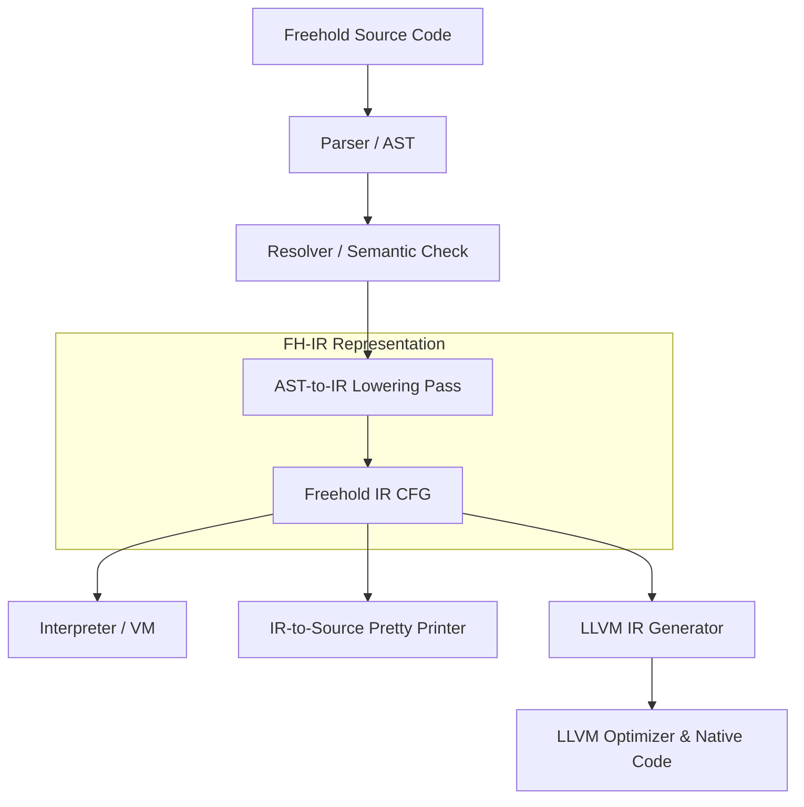

# Design-Spezifikation: Freehold Intermediate Representation (FH-IR) & Interpreter

Dieses Dokument hält die Festlegungen und die Architektur für die Einführung der **Freehold Intermediate Representation (FH-IR)** und des dazugehörigen **Interpreters (VM)** fest. Dieses Design dient als direktes Fundament für die spätere Übersetzung in hochoptimierten nativen Code via **LLVM**.

---

## 1. Compiler-Pipeline & Architektur

Die Einführung der FH-IR schaltet sich als sauber definierte Zwischenstufe in die bestehende Compiler-Pipeline:



---

## 2. Kern-Design-Festlegungen

### A. CFG (Control Flow Graph) & Basic Blocks
Die FH-IR wird als Kontrollflussgraph strukturiert:
* **Basic Blocks**: Jeder Block besteht aus einer linearen Sequenz von Instruktionen (ohne Sprünge) und endet zwingend mit einer **Terminator-Instruktion**.
* **Terminatoren**: Definiert das Ende eines Blocks und bestimmt den Nachfolger-Block:
  * `jump <target_block>` (Unkonditionierter Sprung)
  * `branch_cond <cond_reg>, <true_block>, <false_block>` (Bedingter Sprung)
  * `return <value_reg>` (Rückgabe aus der Routine)
  * `abort <error_name>` (Abbruch mit Fehler)

### B. Variablenverwaltung: `alloca` + `load`/`store` (Stack-Slot-Muster)
Um die Komplexität der SSA-Form (mit $\phi$-Knoten) beim Generieren der IR zu vermeiden, orientieren wir uns an LLVMs nativem Stack-Muster:
* Jede lokale Variable wird beim Eintritt in die Routine über ein `alloca` auf dem virtuellen Stack angelegt.
* Lesezugriffe erfolgen explizit über `load`, Schreibzugriffe über `store`.
* **Vorteil:** Die IR-Generierung bleibt extrem einfach. Beim späteren Kompilieren zu nativem Code wandelt der LLVM-Optimierungspass `mem2reg` dieses flache Speicher-Layout automatisch in hocheffiziente SSA-Register um.

### C. IR-to-Source Decompilierung (Pretty Printing)
Um die IR wieder in lesbaren Freehold-Quellcode zurückzuübersetzen (z. B. zur Anzeige optimierter Pfade oder zum Debuggen), nutzen wir folgende Ansätze:
* **Metadaten-Erhalt**: Variablennamen und Typ-Signaturen bleiben in der IR als Metadaten erhalten.
* **Strukturierte Regionen**: Die IR behält logische Gruppierungen für Kontrollstrukturen (`if`, `while`), um die Rekonstruktion strukturierter Quellcode-Blöcke zu vereinfachen, ohne komplexe Decompiler-Graph-Algorithmen erzwingen zu müssen.

### D. Decompilierung aus nativem Code & LLVM IR
Die Rückgewinnung von Freehold-Quellcode direkt aus kompiliertem nativem Maschinencode (z. B. `.exe`) oder aus LLVM-Zwischendarstellungen ist über folgende Mechanismen möglich:
1. **Debug-Symbole (DWARF / PDB)**: Damit Typen, Variablennamen und Zeilennummern nicht verloren gehen, muss der LLVM-Codegenerator während der Kompilierung DWARF-Metadaten (über LLVMs `DIBuilder`) in das Binärkompilat einbetten. Ohne diese Metadaten (in "stripped" Binaries) sind Namen unwiederbringlich verloren.
2. **LLVM-to-IR Parser**: Ein compiler-interner Pass liest LLVM IR/Bitcode ein und transformiert diese zurück in die typisierte FH-IR.
3. **Kontrollfluss-Rekonstruktion**: Ein Strukturierungs-Algorithmus (z. B. Relooper) analysiert den flachen Kontrollflussgraphen der Maschinenebene und baut daraus die geschachtelten `if`- und `while`-Kontrollstrukturen wieder auf.

---

## 3. Datenstrukturen der FH-IR (Konzeptuell)

In Freehold (analog zu `Ast.fh`) definieren wir die Datenstrukturen für die IR wie folgt:

```freehold
-- Konzept-Entwurf für die IR-Strukturen in Freehold

type IrInstructionKind is record
    name: String -- "ALLOCA", "LOAD", "STORE", "BINARY_OP", "CALL", etc.
end record

type IrInstruction is record
    kind: String
    dest_reg: String
    src_reg_left: String
    src_reg_right: String
    op: String
    literal_value: String
end record

type IrBasicBlock is record
    label: String
    instructions: Array<IrInstruction, 64>
    instruction_count: Integer
    -- Terminator-Informationen
    terminator_kind: String -- "JUMP", "BRANCH_COND", "RETURN", "ABORT"
    target_block_label: String
    true_block_label: String
    false_block_label: String
    return_reg: String
    abort_error: String
end record

type IrRoutine is record
    name: String
    entry_block: String
    blocks: Array<IrBasicBlock, 32>
    block_count: Integer
end record
```

---

## 4. Schritt-für-Schritt Implementierungsplan

### Phase 1: IR-Datenstruktur & AST-Lowering
1. Definition der Typen für `IrInstruction`, `IrBasicBlock` und `IrRoutine` in einem neuen Modul `Compiler.Core.Ir`.
2. Schreiben eines `Transform`/`Lowering`-Passes, der den aufgelösten AST (`Ast.fh`) in die neue IR-Struktur transformiert.
3. Testen des Passes gegen einfache Funktionen (z. B. mathematische Berechnungen und Zuweisungen).

### Phase 2: Der Freehold IR-Interpreter (VM)
1. Erstellung der VM-Infrastruktur:
   * **Activation Frame**: Hält den Stack für lokale Variablen und Registerwerte pro Funktionsaufruf.
   * **Execution Loop**: Läuft durch die Basic Blocks des CFG und führt die Instruktionen sequentiell aus.
2. Integration der Standardbibliothek und Builtins (`Std.IO.log` etc.) in die VM.
3. Verifikation der Semantik anhand der bestehenden Sprachtests.

### Phase 3: Decompiler & Native Decompilation
1. **IR-to-Source Pretty Printer**: Schreiben eines Generators, der die FH-IR wieder in formatierten Freehold-Source-Code ausgibt.
2. **Semantischer Äquivalenz-Abgleich**: Automatisierter Testvergleich (Original-Source vs. Decompiled-Source).
3. **LLVM-IR-to-FH-IR Translator**: Implementierung eines einfachen LLVM-Bitcode-Parsers zur Rückübersetzung von LLVM IR in FH-IR, um Decompilierung auf LLVM-Ebene zu demonstrieren.

### Phase 4: LLVM Native Code Generator & Debug Metadata
1. Übersetzung der FH-IR Basic Blocks in LLVM IR.
2. **Debug-Symbol Generierung**: Einbindung von `DIBuilder`-Aufrufen im LLVM-Backend, um originale Typen, Dateipfade und Variablennamen als DWARF-Informationen in das native Kompilat zu schreiben.
3. Implementierung der Go/C-Bindings zur LLVM-API oder Generierung von `.ll`-Dateien.
4. Anwendung des `mem2reg`-Passes zur automatischen SSA-Optimierung.
