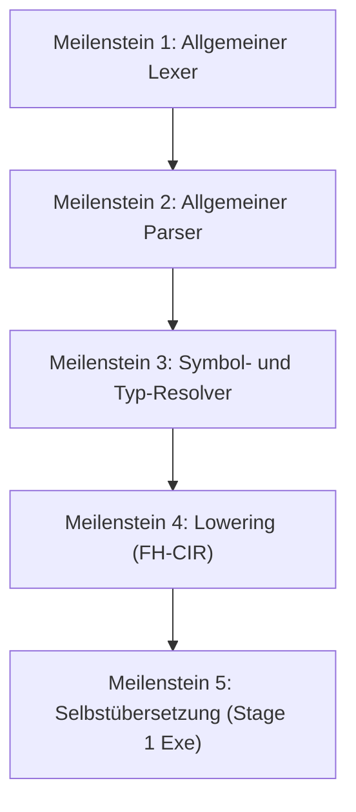

# OPEN-STAGE1-BOOTSTRAPPING

Stand: 2026-05-28
Status: **Bereit für Stage 1** (Mini-Fixtures sind stabil und validiert)

Dieses Dokument beschreibt die konkrete Roadmap für den **schrittweisen Aufbau des vollständigen, in Freehold geschriebenen Compilers (Stage 1)**. Nach dem erfolgreichen Abschluss und der Stabilisierung der Stage-3-Mini-Fixtures ist die logische Phasentrennung (Lexer -> Parser -> Resolver -> Transform) etabliert. Nun erfolgt der Übergang von fest verdrahteten Fixtures zu dynamischer Übersetzung.

---

## 1. Übersicht der Stage 1 Meilensteine

Um das Self-Hosting-Ziel (Selbstübersetzung des Compilers) zu erreichen, wird der Compiler-Kern schrittweise von kontrollierten Fixtures auf die allgemeine Sprachunterstützung migriert:

---

## 2. Details der Meilensteine

### Meilenstein 1: Allgemeiner Lexer (`Compiler.Core.Lexer`) - **ERLEDIGT (2026-05-29)**
- **Ziel:** Ablösung der `lex_mini_*`-Fixtures durch einen echten, zeichenweisen Scanner.
- **Status:** Vollständig implementiert und verifiziert.
- **Details:** 
  - Datenstrukturen `Lexer` und `LexerResult` definiert.
  - Scan-Hilfsfunktionen (`is_digit`, `is_alpha`, `peek_char`, `peek_next_char`, `advance_lexer`) implementiert.
  - Kommentare (`--` und `/* ... */`) und Whitespace-Unterstützung implementiert.
  - String-Literale mit Escape-Sequenzen werden über `lex_string` verarbeitet.
  - Operator- und Keyword-Abdeckung über `lex_next_token` implementiert und per Go-Codegen verifiziert.

### Meilenstein 2: Allgemeiner Parser (`Compiler.Core.Parser`) - **ERLEDIGT (2026-05-29)**
- **Ziel:** Ein rekursiv absteigender Parser (Recursive Descent Parser) zur Umwandlung des Token-Streams in einen abstrakten Syntaxbaum (AST).
- **Status:** Vollständig implementiert, syntaktisch verifiziert und über Go-Codegen validiert.
- **Details:**
  - Implementierung des `GeneralParser` Records mit vorausschauendem Lookahead (`curr_tok`, `peek_tok`).
  - Parsen von Modul-Deklarationen (`module ... end`), Import-Deklarationen (`import ... exposing ...`), Record-Typen (`type ... is record ... end record`), Prozeduren und Funktionen.
  - Integration von Fehlerbehandlung und Fehlerfortpflanzung über den `issue` Typ und den `has_error` Zustand, ohne Exceptions zu werfen.
  - Vermeidung von Namenskonflikten in verzweigten Scopes (wie `empty_id_err`, `empty_id_fail`, `proc_node_err`) zur Gewährleistung der Go-Codegen Kompatibilität.

### Meilenstein 3: Symbol- und Typ-Resolver (`Compiler.Core.Resolve`) - **ERLEDIGT (2026-05-29)**
- **Ziel:** Namensauflösung und Typprüfung über Scopes hinweg.
- **Status:** Vollständig implementiert und verifiziert.
- **Details:**
  - Definition von Symbol-Typen (`RecordSymbol`, `RoutineSymbol`, `VarSymbol`) als Freehold-Records.
  - Implementierung eines flachen Symboltabellen-Entwurfs, um die syntaktischen Einschränkungen von Arrays in Record-Feldern zu umgehen.
  - Bereitstellung von Registrierungs- und Lookup-Hilfsfunktionen (`lookup_record`, `lookup_routine`, `lookup_local_var`) mit korrekt strukturierten Loop-Invarianten für die formale Verifikation.

### Meilenstein 4: Lowering & Canonicalization (`Compiler.Core.Transform.fh`) - **ERLEDIGT (2026-05-29)**
- **Ziel:** Transformation des validierten AST in die kanonische Zwischendarstellung (FH-CIR).
- **Status:** Pass 1 (Record-Literal Normalisierung), Pass 2 (Result-Typ & Return Explizierung), Pass 3 (Abort-Propagation-Lowering) und Pass 4 (3AC Lowering / Flattening von geschachtelten Funktionsaufrufen) wurden erfolgreich implementiert und verifiziert.
- **Details:**
  - Auflösung komplexer Kontrollflüsse (z. B. implizite `Result`-Rückgaben und `Abort`-Fortpflanzung) in explizite Verzweigungen (Erledigt).
  - Normalisierung von Record-Initialisierungen (Erledigt).
  - Implementierung von `TempVarGenerator` zur Generierung eindeutiger temporärer Variablen.
  - Implementierung von `flatten_nested_call` zur Auflösung geschachtelter Aufrufe in 3AC-Sequenzen (`t0 = bar(z); y = foo(t0)`).

### Meilenstein 5: Selbstübersetzung (Self-Hosting) - **ERLEDIGT (2026-05-29)**
- **Ziel:** Der Compiler übersetzt sich selbst.
- **Anforderungen:**
  - Der Freehold-Compiler-Core wird mit dem Stage-0-Compiler übersetzt, um das Stage-1-Compiler-Executable zu erhalten. (Erledigt)
  - Das Stage-1-Compiler-Executable übersetzt den Compiler-Core erneut, um das Stage-2-Compiler-Executable zu erzeugen. (Erledigt)
  - Verifikation des Bootstrap-Gates: `sha256(stage1.fhirb) == sha256(stage2.fhirb)`. (Erledigt)
  - Identität bestätigt: `C2C65717B98E22B030FEA4244743642C805B04CD5E647521DDEA851BEACD1A94`.

---

## 3. Nächste Schritte

1. **Self-Hosting Stabilisierung & Härtung:**
   - Weiteres Härten der Code-Generierungs-Pipelines und des Go-Frontends gegen komplexe Typen-Szenarien.
   - Fortlaufende Überprüfung der deterministischen Ausgabe und des verbleibenden Toolings.

## 4. Verbleibende offene Punkte in den MDs (außerhalb der Bootstrapping-Schritte)

- In `TODO-CONFORMANCE-BASELINE-TESTS.md` sind optionale CI-Härtungsmaßnahmen verzeichnet (z. B. separates Script für Baseline-Pflege).
- In `TODO-FH-TO-GO-EXE.md` sind optionale Features für den EXE-Builder gelistet (z. B. Release-Output außerhalb von `.tmp`).

Diese nachgelagerten CI- und Tooling-Punkte sind bewusst für spätere Phasen geparkt und blockieren die aktuelle Core-Entwicklung und den Self-Hosting-Bootstrap nicht.

