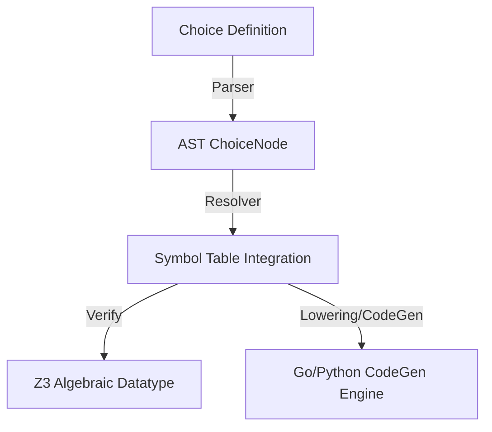

# TODO: Choice & Pattern Matching Specification for Freehold
**Format Reference:** Google Open Knowledge Format (OKF) & Design Blueprint  
**Status:** Planned Roadmap (Bootstrapping Stage-4 Ready)  
**Target Domain:** Language Design, Compiler Architecture & SMT Verification  

---

## 1. Executive Summary & Design Goals

By introducing algebraical sum types (now explicitly named `choice` to prevent keywords conflict) and structured `case`-based destructuring (`pattern matching`), **Freehold** advances to a level of formal safety, declaration power, and execution elegance comparable to modern functional-imperative systems languages (such as Rust), while improving SMT verifiability using the Z3 theorem prover.

---

## 2. Resolving the Keyword Conflict: `variant` vs. `choice`

### 2.1 The Twofold Nature of `variant`
Freehold originally suffered from a critical name collision regarding the term `variant`:
1. **Loop Termination Variant (`while ... variant ...`):** An existing, fully supported mathematical expression checked by Z3 to guarantee loop termination (e.g. `variant 3 - i`).
2. **Type Variant (Sum Type):** The structural choice representing multiple discrete data payloads.

Using `variant` for both features introduces severe cognitive load for developers and parsing ambiguities inside LL(1) deterministic lookahead parsers.

### 2.2 The Unified Solver: The `choice` Keyword
To prevent conflict and establish perfect grammatical clarity, Freehold officially designates the keyword **`choice`** for declaring algebraic sum types. 
* This resolves conflict with loop execution elements completely.
* It remains brief, self-describing, and perfectly maps to SMT-LIB's non-deterministic choices and native algebraic datatypes as well as native interfaces in Go.

---

## 3. Part 1: Core Concepts & Architectural Benefits

### 3.1 SMT-LIB and Z3 Mathematical Verifiability
* **Native Z3 Datatype Modeling:** Sum types represent directly as `(declare-datatypes ...)` in SMT-LIB v2 without state-space explosion.
* **Reduction of Tag Constraints:** Simulating optional records with variable tags requires complex boolean invariant equations. SMT Solvers natively resolve algebraic sum types, drastically accelerating verification time.
* **Exhaustiveness Analysis:** Z3 mathematically proves complete coverage of cases, discarding hazardous and imprecise "default" branches.

### 3.2 Eliminating Invalid States (No Illegal States)
* **Constructional Correctness at Compile-Time:** Rather than managing massive, sparse record layouts populated by optional or null-valued fields, `choice` guarantees that only the requested structural payload of a specific constructor physically exists in memory.

### 3.3 Structural Pattern Matching
* **Unified Access Execution:** Extracting payload variables and verifying constructor variants are fused into a single atomic compile-time checked step.

---

## 4. Part 2: Inner Logical & Technical Realization



### 4.1 Go Transpilation Engineering
* Transpiles to a closed Go interface utilizing an unexported guard method (preventing outward extension):
  ```go
  type OrderBusMessage interface {
      isOrderBusMessage()
  }
  ```
* Implements each constructor layout as a concrete Go `struct` matching the interface:
  ```go
  type ValidateOrder struct {
      Id string
  }
  func (ValidateOrder) isOrderBusMessage() {}
  ```
* Lowers `case` blocks directly into highly efficient Go `switch message.(type)` jump structures:
  ```go
  switch msg := message.(type) {
  case ValidateOrder:
      id := msg.Id
      // safe execution
  }
  ```

### 4.2 Python Transpilation Engineering
* Maps native `match-case` mechanisms introduced in Python 3.10:
  ```python
  match message:
      case ValidateOrder(id):
          # bound context execution
  ```

---

## 5. Part 3: Complete Advanced Language Integration (The Roadmap)

### 5.1 Generics Support
Allows generic optionals and result structures directly inside standard libraries:
```freehold
choice Option<T> =
    Some(val: T)
  | None
end Option

choice Result<T, E> =
    Ok(value: T)
  | Err(error: E)
end Result
```

### 5.2 Recursive (Inductive) Datatypes
Supports recursive structures for list and tree nodes, mapped to Z3 recursive datatypes:
```freehold
choice List<T> =
    Nil
  | Cons(head: T, tail: List<T>)
end List
```

### 5.3 Pattern Guards
Conditional case routing using the `when` filter keyword:
```freehold
case message is
    ValidateOrder(id) when String.length(id) > 10 =>
        -- Matched only if ID length complies
    ValidateOrder(id) =>
        -- Fallback
end case
```

### 5.4 Nested Sub-Pattern Matching
Deep structured destructuring extraction in a single analytical step:
```freehold
case bus_envelope is
    MessageEnvelope(sender, ValidateOrder(id)) =>
        -- Extract envelope sender and payload ID on the fly
end case
```

### 5.5 Wildcards and Binding Aliases
* **Wildcards (`_`):** Ignored patterns preventing unused symbols: `ReserveInventory(_) => ...`.
* **Binding Aliases (`as`):** Binding both sub-elements and parent elements: `ValidateOrder(id) as full_msg => ...`.

### 5.6 Frontend Analysis Checklists
Before code generation, the compiler frontend MUST validate:
1. **Exhaustiveness:** Flag warning/error if a specific choice path is unhandled.
2. **Redundancy (Unreachable Patterns):** Detect dead match cases covered by preceding wildcard/broader patterns.
