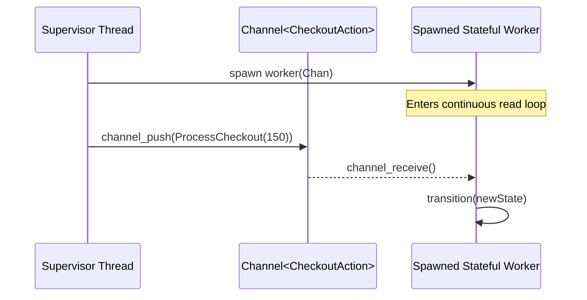

# TODO: FH-Native-V2 Compiler Core & Language Specification
**Format Reference:** Google Open Knowledge Format (OKF) & Architectural Design Blueprint  
**Status:** Planned Roadmap (Post-Bootstrapping Stage-5 & Stage-6 Features)  
**Target Domain:** Language Design, Compiler Architecture, SMT Verification & Async Execution  

---

## 1. Executive Summary & V2 Vision

The second generation of the native, self-hosted Freehold compiler (**`FH-Native-V2`**) elevates the language from its minimalist, bootstrap-centric core to a fully-featured, mathematically-verified systems programming language.

While `FH-Native-V1` focused strictly on the minimal, safe compiler dialect required to achieve byte-identical self-compilation, `FH-Native-V2` introduces advanced type systems, dynamic collection mapping, and distributed workflow modeling.

---

## 2. Topic 1: Choice & Pattern Matching (Tagged Unions)

By introducing algebraic sum types (named `choice` to prevent keywords conflict with loop variants) and structured `case`-based destructuring (`pattern matching`), Freehold advances to a level of formal safety and declaration power comparable to modern functional-imperative systems languages.

### 2.1 Keyword Conflict Resolution: `variant` vs. `choice`
Freehold originally suffered from a critical name collision regarding the term `variant`:
1. **Loop Termination Variant (`while ... variant ...`):** An existing, fully supported mathematical expression checked by Z3 to guarantee loop termination (e.g. `variant 3 - i`).
2. **Type Variant (Sum Type):** The structural choice representing multiple discrete data payloads.

Using `variant` for both features introduces severe cognitive load for developers and parsing ambiguities inside LL(1) deterministic lookahead parsers. Thus, Freehold officially designates the keyword **`choice`** for declaring algebraic sum types.

### 2.2 SMT-LIB and Z3 Mathematical Verifiability
* **Native Z3 Datatype Modeling:** Sum types represent directly as `(declare-datatypes ...)` in SMT-LIB v2 without state-space explosion.
* **Reduction of Tag Constraints:** Simulating optional records with variable tags requires complex boolean invariant equations. SMT Solvers natively resolve algebraic sum types, drastically accelerating verification time.

### 2.3 Syntax and Language Specification
```freehold
choice Option<T> =
    Some(val: T)
  | None
end Option

choice Result<T, E> =
    Ok(value: T)
  | Err(error: E)
end Result

choice List<T> =
    Nil
  | Cons(head: T, tail: List<T>)
end List
```

### 2.4 Pattern Matching & Destructuring
Extracting payload variables and verifying constructor choices are fused into a single atomic compile-time checked step:
```freehold
case message is
    ValidateOrder(id) when String.length(id) > 10 =>
        -- Matched only if ID length complies
    ValidateOrder(id) =>
        -- Fallback
end case
```

### 2.5 Lowering & Transpiler Engineering
* **Go Transpilation:** Transpiles to a closed Go interface utilizing an unexported guard method (preventing outward extension) and concrete structs matching the interface, mapped natively to Go Type Switches.
* **Python Transpilation:** Maps down directly to Python 3.10 native `match-case` blocks.

---

## 3. Topic 2: Native Map (Associative Arrays) & Sequence Simulation

To implement dynamic lookups, configuration mappings, and service registry patterns efficiently, Freehold requires a native, safe, and easily verifiably finite mapping structure.

### 3.1 Syntax & Language Integration
```freehold
-- Map from String to Integer
let scores: Map<Integer> = Map<Integer> {
    "Alice": 95,
    "Bob": 88
}
```

### 3.2 Bounded Record Iteration
To ensure termination and bounded iteration loops in SMT/Z3, we extract a statically-bounded array of keys and the registration size:
```freehold
let registry_keys: Array<String, 16> = Map.keys(player_registry)
let registry_size: Integer = Map.size(player_registry)

let i: Integer = 0
while i < registry_size invariant i >= 0 and i <= registry_size do
    let current_key: String = registry_keys[i]
    case player_registry[current_key] is
        Ok(player) =>
            -- Handle safe row elements access
        Err(_) =>
            -- Declared unreachable by formal proof constraints
    end case
    i := i + 1
end
```

### 3.3 SMT-LIB and Z3 Mathematical Modeling
Strings and associative mappings are represented using SMT-LIB's native **Theory of Arrays** mapping keys to value options:
$$\text{Map}\langle\text{Key}, \text{Value}\rangle \implies (\text{Array } \text{Key } \text{Value})$$
* **Insertion:** Mapped to SMT `(store map key (Ok val))`
* **Retrieval:** Mapped to SMT `(select map key)`

### 3.4 The Functional Minimalism Principle (Lists via Maps)
Instead of forcing two complex structures (Lists and Maps) through the Parser during bootstrapping, Freehold uses maps to simulate lists:
```freehold
type List<T> is record
    data: Map<Integer, T>  -- Sequential index mapping
    length: Integer         -- Count of populated elements
end record
```
1. **SMT Convergence:** Z3 handles lists and maps uniformly, minimizing SMT translation engine complexity.
2. **Post-Bootstrapping SDK (`List.fh`):** Immediately after bootstrapping, dynamic list sequences are defined in pure Freehold within `List.fh` wrapping Map collections, providing high-level helper functions (`push`, `pop`, `get`).

---

## 4. Topic 3: Set Specification and Verification

A Set (`Set<T>`) is a collection of unique, unordered values of type `T`. It is extremely powerful for writing declarative contracts (`requires`, `ensures`) but lacks standard, zero-overhead Go runtimes.

### 4.1 Two-Phased Roadmap Strategy
1. **Phase 1: "Ghost" / Specification-Only Sets:** Sets are introduced initially only inside contracts. This allows maximum Z3 proof power (uniqueness checks, domains registration) and are completely stripped from compiled Go/Python execution code (absolute Zero-Footprint).
2. **Phase 2: Native Runtime Sets:** Compile sets down to Go structmaps (`map[T]struct{}`) and Python native `set[T]` collections.

### 4.2 SMT Integration
SMT-LIB v2 represents sets as functional maps to Booleans:
$$\text{Set}\langle T \rangle \implies (\text{Array } T \text{ Bool})$$

---

## 5. Topic 4: State Machine Workflows, Spawns & Channels

Business workflows are asynchronous, parallel, and state-dependent. Freehold models processes as Deterministic Finite Automata (DFA) using `choice` structures coupled with lightweight scheduling actors.



### 5.1 State Transitions Safety
```freehold
function transition(state: CheckoutState, action: CheckoutAction) returns CheckoutState
ensures case state is Completed(_) => result = state | _ => true end
is
    case state is
        CartCreated =>
            case action is
                ProcessCheckout(amt) => return PaymentPending(amt)
                _                    => return Failed("Invalid action")
            end case
        PaymentPending(amt) =>
            case action is
                ConfirmSuccess(tx) => return Completed(tx)
                _                  => return state
            end case
        Completed(_) => return state
        Failed(_)    => return state
    end case
end transition
```

### 5.2 Spawns & Channels Architecture
* **`Channel<T>`:** Typed thread-safe FIFO message pipelines.
* **`spawn`:** Initiates independent, memory-isolated green fibers running concurrent loops:
  ```freehold
  spawn start_checkout_worker(queue)
  ```
* **Verification Targets:** SMT checking validates deadlock absence (buffer capacity proofs) and confirms that terminal sink states like `Completed` can never be reverted back to pending/failed.

---

## 6. Topic 5: Dynamic AST Architecture & Multi-Invariant Loops

In `FH-Native-V1`, the bootstrap compiler uses flat, pre-allocated record arrays to model the AST. This is highly robust for memory constraints during bootstrapping but forces single-scalar tracking fields inside AST nodes, such as a single `invariant_expr_idx: Integer` inside `StmtNode`.

With **`FH-Native-V2`**, the compiler upgrades to a dynamic, pointer-rich heap-allocated AST or native list collections. This allows full alignment with the grammar's EBNF specification:
$$\text{while\_stmt} \Rightarrow \text{while } \text{expr } \text{invariant\_clause}^+ \ [\text{variant\_clause}] \ \text{do } \text{loop\_block } \text{end while}$$

### 6.1 AST Modeling Upgrade
Instead of a single index, the `WhileStmt` representation in V2 supports an array or list of invariants:
```freehold
type StmtNode is choice
    -- ... other statement choices ...
    | WhileStmt(
        cond_expr: ExprNode,
        invariants: List<ExprNode>,
        variant_expr: Option<ExprNode>,
        body: List<StmtNode>
    )
end choice
```

### 6.2 Benefits for Formal Verification
1. **Separation of Concerns:** Developers can split loop invariants into discrete, logical assertions (e.g., lower bound, upper bound, array state equivalence) rather than packing them into a single massive `and` clause.
2. **SMT Parity:** In WhyML, multiple `invariant` statements can be emitted sequentially:
   ```why3
   while i < len do
     invariant { 0 <= i }
     invariant { i <= len }
     invariant { sum >= 0 }
     ...
   ```
3. **Debuggability:** If Z3 fails to prove one of the invariants, the compiler can trace the failure to the exact line number of the specific failing `invariant_clause` in the source file, boosting diagnostic accuracy.

### 6.3 WhyML AST Lowering Parity for Nested Structures
In `FH-Native-V1`, structures like `CASE` (Pattern Matching) and `SCOPE` (Concurrency/Spawns) are syntactically checked by the parser, but they are not fully represented as detailed nested sub-trees inside the flat, array-based `StmtNode` bounds. This constraint makes a general, structured WhyML export of these pathways technically impossible in V1.

With the dynamic `choice`-based tree models introduced in **`FH-Native-V2`**, the WhyML-Codegenerator (`WhyMLCodeGen.fh`) will natively translate these nesting structures:
* **Pattern Matching (`CaseStmt`):** Lowered into native WhyML pattern matching blocks:
  ```why3
  match expr with
  | Branch1 -> ...
  | Branch2 -> ...
  | _ -> ...
  end
  ```
* **Concurrent Scopes (`ScopeStmt`):** Lowered into structural simulations matching thread sandboxes:
  ```why3
  let scope = () in
  begin
    (* Sparked async verification nodes *)
  end
  ```


