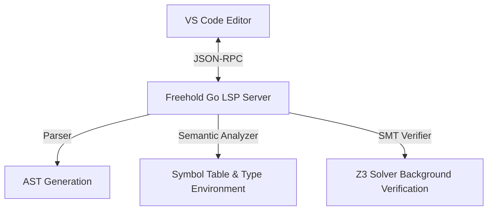

# TODO: Freehold VS Code Extension & LSP Server (Autocomplete, Diagnostics & Verification)

## 1. Architectural Blueprint
To achieve modern editor features like Autocomplete, Diagnostics-on-the-fly, and Formal Verification Feedback inside VS Code, Freehold implements the **Language Server Protocol (LSP)**.



---

## 2. Task breakdown

### Phase 1: Go-Based LSP Server Scaffolding
- [ ] Create an LSP server binary entry point under `go-frontend/cmd/freehold-lsp/`.
- [ ] Integrate a trusted Go JSON-RPC LSP library (e.g. `github.com/sourcegraph/go-lsp` or `golang.org/x/tools/gopls`'s underlying protocol engine).
- [ ] Implement core LSP method handlers:
  - `initialize` & `initialized`
  - `textDocument/didOpen`, `textDocument/didChange`, `textDocument/didSave`

### Phase 2: Live AST Diagnostics & Symbol Tracking
- [ ] On file change/open events, run `parser.Parse` and the `semantic.Analyzer` on the current buffer state.
- [ ] Map internal parser-diagnostics into LSP native `Diagnostic` arrays.
- [ ] On `textDocument/publishDiagnostics`, publish syntax & semantic type-mismatch diagnostics instantly to the client.

### Phase 3: Autocomplete (`textDocument/completion`) & Hover (`textDocument/hover`)
- [ ] Track dot-operator (`.`) triggers on records and lookup their properties in the `SymbolTable` to supply completion items.
- [ ] Support hover events on variables, routines, and custom types to display type signature decorations.

### Phase 4: Async SMT formal verification overlay (Optional/Premium)
- [ ] Trigger background SMT contract validation asynchronously on file save.
- [ ] Inject failed postconditions/invariants as diagnostic errors directly onto the lines where the contracts fail.

---

## 3. VS Code Client Scaffolding (`freehold-extension`)
A lightweight TypeScript VS Code extension will launch the native binary:
```typescript
const serverOptions: ServerOptions = {
    run: { command: "freehold-lsp" },
    debug: { command: "freehold-lsp" }
};
const clientOptions: LanguageClientOptions = {
    documentSelector: [{ scheme: 'file', language: 'freehold' }]
};
```
