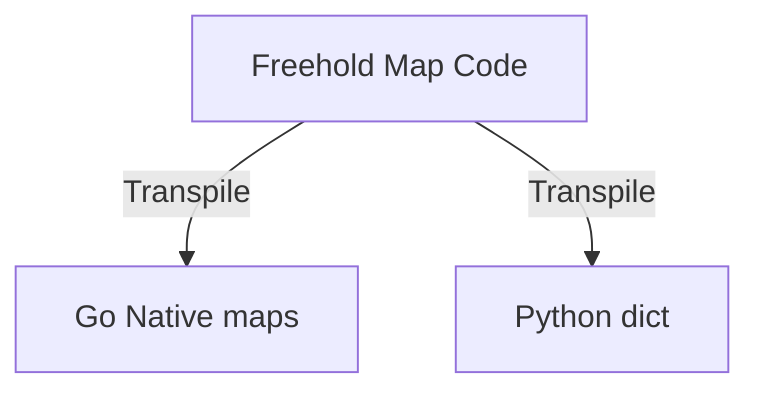

# TODO: Native Map (Associative Arrays) Specification for Freehold
**Format Reference:** Google Open Knowledge Format (OKF) & Design Blueprint  
**Status:** Planned Roadmap (Bootstrapping Stage-4 Ready)  
**Target Domain:** Language Design, Compiler Architecture & SMT Verification  

---

## 1. Executive Summary & Design Goals

To implement dynamic lookups, configuration mappings, and service registry patterns efficiently, **Freehold** requires a native, safe, and easily verifiably finite mapping structure. 

This specification codifies the introduction of native associative arrays (**`Map<T>`** or simply **`Map`**), providing a highly optimized path for both formal verification via SMT (Z3) and native code transpilation (Go, Python).

---

## 2. Part 1: Syntax & Language Integration

### 2.1 Type Declaration & Initializers
Associative arrays are strongly typed, mapping a `String` key (or an `Integer` key in unified list-simulation modes) to a generic or concrete value type `T`.

```freehold
-- Map from String to Integer
let scores: Map<Integer> = Map<Integer> {
    "Alice": 95,
    "Bob": 88
}

-- Empty Map declaration
let registry: Map<String> = Map<String> {}
```

### 2.2 Access, Insertion, and Deletion Operations
An index-based API ensures an intuitive, syntactically clean development model:

* **Insertion / Modification:**
  ```freehold
  scores["Charlie"] := 92
  ```
* **Safe Retrieval (using `Result`):**
  Direct index lookup is partial and might fail. To guarantee complete safety under verification, direct lookup returns a `Result` type:
  ```freehold
  case scores["Alice"] is
      Ok(val) => -- Value found! Let's utilize 'val'.
      Err(_)  => -- Key was not registered.
  end case
  ```
* **Key Existence Validation:**
  ```freehold
  if Map.has_key(scores, "Alice") then
      -- safe operation guaranteed
  end
  ```
* **Key Collections Retrieval:**
  ```freehold
  let players: Array<String, 16> = Map.keys(scores)
  ```
* **Removal Operation:**
  ```freehold
  Map.remove(scores, "Bob")
  ```

---

## 3. Part 2: Comprehensive Map & Multi-Record Iteration Demo

Here is a complete, annotated model of **Declaration, Definition**, and **Full Row Iteration** for a map containing exactly 7 initial records of a custom user type `Player`.

```freehold
module Match.MapDemo

import Std.IO exposing print

-- 1. Definition of the custom structured player payload
type Player is record
    score: Integer
    is_active: Boolean
    level: Integer
end record

function main() returns Integer
is
    -- 2. Declaration and instantiation of a Map containing exactly 7 records
    let player_registry: Map<Player> = Map<Player> {
        "Chris":     Player { score: 100, is_active: true,  level: 5 },
        "Alex":      Player { score: 120, is_active: false, level: 8 },
        "John":      Player { score: 95,  is_active: true,  level: 3 },
        "Sophia":    Player { score: 150, is_active: true,  level: 10 },
        "Emma":      Player { score: 80,  is_active: false, level: 2 },
        "Liam":      Player { score: 110, is_active: true,  level: 6 },
        "Olivia":    Player { score: 130, is_active: false, level: 7 }
    }

    -- 3. Singular safe retrieval via Result pattern matching (Existential check)
    let search_key: String = "Chris"
    case player_registry[search_key] is
        Ok(player) =>
            -- Destructuring and field access within formatting templates
            print(String.template("Player Chris found! Score: ${score}, Level: ${lvl}", 
                score: player.score, 
                lvl: player.level
            ))
        Err(_) =>
            print("Chris does not exist in the player registry.")
    end case

    -- 4. Safe full-row iteration over the custom Player map
    -- To ensure termination and bounded iteration loops in SMT/Z3,
    -- we extract a statically-bounded array of keys and the registration size.
    let registry_keys: Array<String, 16> = Map.keys(player_registry)
    let registry_size: Integer = Map.size(player_registry)
    
    let i: Integer = 0
    -- Z3 Loop Invariant guarantees that 'i' never overflows the bounded sizes
    while i < registry_size invariant i >= 0 and i <= registry_size do
        let current_key: String = registry_keys[i]
        
        -- SMT Select guarantees that key retrieval from 'keys[i]' always resolves to an 'Ok' result
        case player_registry[current_key] is
            Ok(player) =>
                -- Safe string-template interpolation of boolean state and key/row parameters
                let active_status: String = "Inactive"
                if player.is_active then
                    active_status := "Active"
                end

                print(String.template("Row ${index}: Name: ${name} -> Score: ${score}, Level: ${lvl}, Status: ${status}",
                    index: i + 1,
                    name: current_key,
                    score: player.score,
                    lvl: player.level,
                    status: active_status
                ))
            Err(_) =>
                -- Declared unreachable by formal proof assertions
                print("Retrieval failure (unreachable under formal proof bounds).")
        end case

        i := i + 1
    end

    -- 5. Map-of-Scalars (Integer Demo) Integration
    let team_scores: Map<Integer> = Map<Integer> {}
    team_scores["TeamRed"] := 420
    team_scores["TeamBlue"] := 580

    let team_keys: Array<String, 16> = Map.keys(team_scores)
    let team_count: Integer = Map.size(team_scores)
    
    let j: Integer = 0
    while j < team_count invariant j >= 0 and j <= team_count do
        let team_name: String = team_keys[j]
        
        case team_scores[team_name] is
            Ok(score) =>
                print(String.template("Score: Team ${name} -> ${score} Points.", 
                    name: team_name, 
                    score: score
                ))
            Err(_) =>
                print("Error retrieving team score.")
        end case

        j := j + 1
    end

    return 0
end main
```

---

## 4. Part 3: SMT-LIB and Z3 Mathematical Modeling

Strings and associative mappings are traditionally hard to verify without triggering infinite state spaces. Freehold resolves this by modeling associative arrays using SMT-LIB's native **Theory of Arrays**.

In SMT-LIB v2, a map is represented using the standard Select/Store array semantics:
$$\text{Map}\langle\text{Key}, \text{Value}\rangle \implies (\text{Array } \text{Key } \text{Value})$$

### 4.1 SMT Quantifiers & Functional Axioms

1. **Empty Map Initialization:**
   An empty map behaves as a constant array mapped to a default "uninitialized" (or failure Result) state:
   $$\text{empty\_map} \equiv (\text{as const } (\text{Array String } \text{Result})) \text{ Err(KeyNotFound)}$$

2. **Store Action (Insertion):**
   Setting `map[key] := val` translates directly to:
   $$\text{map}_{\text{new}} \equiv (\text{store } \text{map}_{\text{old}} \text{ key } (\text{Ok } \text{val}))$$

3. **Select Action (Retrieval):**
   Retrieving `map[key]` translates directly to:
   $$\text{result} \equiv (\text{select } \text{map } \text{key})$$

4. **Bounded Array Keys (Finite Iteration Guarantee):**
   To verify loops iterating over `Map.keys()`, the compiler injects a finite bound constraint on the keys array, proving that:
   $$\forall i \in \text{Integer}, \quad 0 \le i < \text{length}(\text{keys}) \implies (\text{select } \text{map } \text{keys}[i]) \ne \text{Err}$$

---

## 5. Part 4: Lowering & Transpiler Engineering



### 5.1 Go Transpilation
The transpiler maps `Map<T>` directly to Go's highly optimized, native hash maps.

* **Declaration:**
  ```go
  var scores map[string]int64 = map[string]int64{
      "Alice": 95,
      "Bob": 88,
  }
  ```
* **Index Retrieval & Result Coercion:**
  ```go
  // Wrap lookup in Freehold's Ok/Err structure
  val, ok := scores["Alice"]
  if ok {
      return MakeOk(val)
  } else {
      return MakeErr("KeyNotFound")
  }
  ```
* **Insert/Update:**
  ```go
  scores["Charlie"] = 92
  ```
* **Delete:**
  ```go
  delete(scores, "Bob")
  ```

### 5.2 Python Transpilation
Maps down to Python's dictionary types:

* **Declaration:**
  ```python
  scores: dict[str, int] = {
      "Alice": 95,
      "Bob": 88
  }
  ```
* **Safe Lookup:**
  ```python
  val = scores.get("Alice")
  if val is not None:
      return Result_Ok(val)
  else:
      return Result_Err("KeyNotFound")
  ```

---

## 6. Part 5: High-Performance Bounds & Safety Gates

To prevent runtime errors, memory leaks, or execution halts during self-hosted compiler bootstrapping:

1. **No Out-of-Memory (OOM) via State Growth:** During verification, the compiler enforces a static `invariant` limiting the total elements allowed inside a map inside safety-critical paths (e.g. `Map.size(records) <= 256`), allowing Z3 to prove state-space saturation bounds.
2. **Strict Non-Nil / Non-Null Guarantees:** Go map reads of missing keys yield zero-values. Under Freehold's contract validation, the direct wrapping in `Result` and mandatory `case` destructuring completely prevents reading unitialized memory states.

---

## 7. Part 6: Design Discussion Guidelines (Lists vs. Maps)

### 7.1 The Engineering Dilemma: Lists or Sets?
When planning collections beyond arrays, we analyzed the priorities between ordered Lists (Sequences) and unordered Sets (Mathematical Sets):
* **Lists (Slices/Sequences):** Crucial for compiler infrastructure. AST parsing, tokens representation, parameter arguments, and instruction blocks are strictly orderly sequences.
* **Sets:** Excellent for formal specifications and constraints (membership, uniqueness), but has no direct, zero-allocation native implementation in Go, requiring fallback key mapping structures.

### 7.2 The Unified Structural Realization (Maps as SMT-Parity Lists)
Instead of forcing two complex types (Lists and Maps) through the Parser and Code-Generator during the crucial bootstrapping phases, Freehold applies a **Functional Minimalism Principle**:
1. **Representing Sequences via Integer-Indexed Maps:**
   A sequence `["red", "green", "blue"]` is modeled as an integer-indexed mapping paired with an element counter:
   ```freehold
   type List<T> is record
       data: Map<Integer, T>  -- Sequential index mapping
       length: Integer         -- Count of populated elements
   end record
   ```
2. **SMT Formulation Convergence:**
   Z3 handles maps and lists similarly via the standard **Theory of Arrays** ($\text{f}: \text{Index} \to \text{Value}$), eliminating the need for separate parser ast structures or logic in the SMT translator.
3. **Sequential Safety Verification:**
   The compiler prevents sparse index gaps (*holes in sequences*) through encapsulation contracts on library operations (`requires index >= 0 and index < length` on writes).

### 7.3 Post-Bootstrapping Stage-4 Strategy
* **Phase 1 (Native Maps):** Implement `Map` as a native, compiler-recognized keyword mapping directly to native `map` in Go and `dict` in Python.
* **Phase 2 (Standard Library `List.fh`):** Immediately after bootstrapping succeeds, create dynamic list sequences purely within Freehold code using `List.fh` wrapping `Map` collections. This provides high-level APIs (`push`, `pop`, `get`) without requiring parser modifications.
