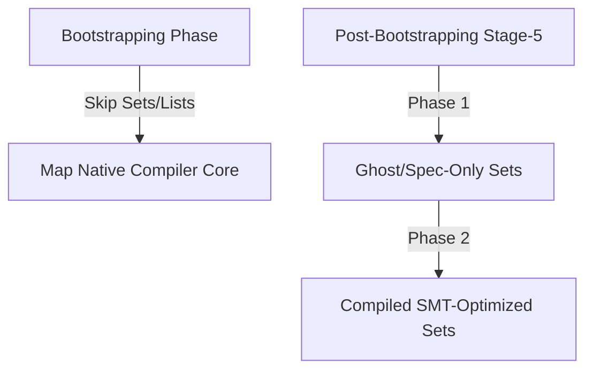

# TODO: Set (Mengen) Specification and Roadmap for Freehold
**Format Reference:** Google Open Knowledge Format (OKF) & Design Blueprint  
**Status:** Planned Roadmap (Post-Bootstrapping Stage-5)  
**Target Domain:** Language Design, Contract Verification & SMT Set Theory  

---

## 1. Executive Summary & Core Concept

A **Set** (`Set<T>`) is a collection of unique, unordered values of type `T`. 

In **Freehold**, which prioritizes formal verifiability and high-performance systems engineering, Sets occupy a unique space:
* They are **mathematically supreme** for writing declarative contracts (`requires`, `ensures`), proving element uniqueness, membership, and domain containment constraints.
* However, they pose a **runtime challenge** in systems-level languages (like Go) that lack native, zero-overhead set structures.

This specification codifies the progressive roadmap for introducing Sets into Freehold, separating verification-time capabilities from runtime execution optimization.

---

## 2. Part 1: SMT-LIB and Z3 Modeling (The True Value of Sets)

For the Z3 theorem prover, sets are native mathematical entities. They are modeled using either the native **SMT-LIB Theory of Sets** or as mapping functions from `T` to `Bool`:
$$\text{Set}\langle T \rangle \implies (\text{Array } T \text{ Bool})$$

### 2.1 Pure SMT Assertions
Using native set expressions in contracts completely avoids messy and complex loop invariants:

* **Membership (`Set.contains`):**
  $$(select \text{ set } \text{element}) \equiv \text{True}$$
* **Set Union (`Set.union`):**
  $$(map \text{ or } \text{set1 } \text{set2})$$
* **Set Intersection (`Set.intersect`):**
  $$(map \text{ and } \text{set1 } \text{set2})$$
* **Subset relations (`Set.is_subset`):**
  $$\forall x, \quad (select \text{ set1 } x) \implies (select \text{ set2 } x)$$

---

## 3. Part 2: The Two-Phased Roadmap (Spec-Only vs. Runtime)

To prevent compiler bloat during the critical **Stage-3 & Stage-4 Bootstrapping** cycles, the implementation of Sets is strictly split into two progressive phases:



### 3.1 Phase 1: "Ghost" / Specification-Only Sets (Immediate Post-Bootstrapping)
To gain immediate verification power with **zero runtime performance penalty**, we introduce Sets first as "Ghost Types" (specification-only):
* **Behavior:** These sets can only be utilized inside contracts (`requires`, `ensures`, `invariant`) and verification methods.
* **Compiler Action:** The transpiler completely removes (strips) these structures from the generated Go/Python production source code.
* **Benefit:** Maximum analytical power inside Z3 for checking scopes, uniqueness, and containment invariants, with absolute zero allocation or memory footprint in the compiled binary.

### 3.2 Phase 2: Native Runtime Sets (Future Stage)
Adding physical runtime support for sets after the language is fully self-hosted.

* **Lowering to Go:** Since Go has no native `set` keyword, the transpiler lowers a `Set<T>` into a boolean map structure:
  ```go
  var mySet map[string]bool = map[string]bool{}
  ```
  Or a memory-optimized struct-map for zero-allocation keys:
  ```go
  var mySet map[string]struct{} = map[string]struct{}{}
  ```
* **Lowering to Python:** Directly targets Python's optimized native `set` type:
  ```python
  my_set: set[str] = set()
  ```

---

## 4. Part 3: Proposed Syntax and Design Demo

Here is a conceptual preview of how Sets will look when fully integrated into Freehold's syntax:

```freehold
module Match.SetDemo

import Std.IO exposing print

-- Defining a system service record
type Service is record
    name: String
    is_critical: Boolean
end record

-- A procedure utilizing both Spec-Only (Ghost) and Runtime Sets
procedure register_services(active_names: Set<String>)
    -- Pre-condition: Critical default services MUST be pre-registered (Z3 Spec Set)
    requires Set.contains(active_names, "auth-service")
    -- Space constraint verification check
    requires Set.size(active_names) <= 8
is
    print("Services integrity verified via Set theory.")
    
    -- Creating a runtime set of identifiers
    let critical_registry: Set<String> = Set<String> { "auth-service", "gateway-service" }
    
    -- Checking membership
    if Set.contains(critical_registry, "database-service") then
        print("Database is classified as critical.")
    else
        print("Database is non-critical.")
    end
end register_services
```

---

## 5. Part 4: Technical Summary & Architectural Decisions

| Aspect | Associative Arrays (Maps) | Sets |
| :--- | :--- | :--- |
| **Bootstrapping Priority** | **High** (Needed for intermediate tables, resolver indexing) | **Low** (Can be deferred entirely) |
| **Compiler Status** | **Native Compiler Core** | **Ghost Spec (Phase 1) ➔ Native Lowering (Phase 2)** |
| **Go Representation** | `map[string]T` (native, highly optimized) | `map[T]struct{}` (simulation wrapper) |
| **SMT Representation** | SMT Array theory (Standard) | SMT Set / Map theory (High-Level) |
