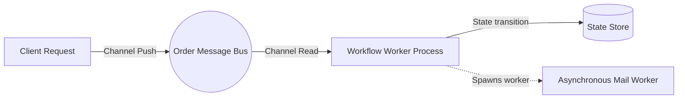
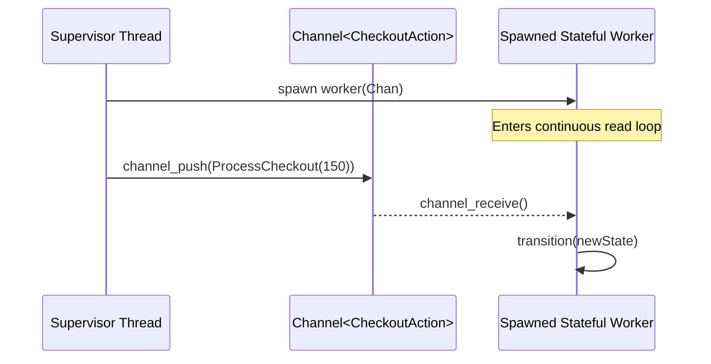

# TODO: Work & Business Flows Specification for Freehold
**Format Reference:** Google Open Knowledge Format (OKF) & Design Blueprint  
**Status:** Planned Roadmap (Post-Bootstrapping Stage-6 Workflow System)  
**Target Domain:** Workflows, Distributed Systems, Channels, State Machines & Async Verification  

---

## 1. Executive Summary & Design Philosophy

Business flows and stateful processes (such as payment pipelines, inventory checkouts, or order fulfillment) are inherently asynchronous, concurrent, and state-dependent. In high-safety domains, failures in state transition verification can result in invalid double-spending, lost network messages, or frozen system deadlocks.

**Freehold's goal** is to provide native primitives to model workflows as **Statically-Verifiable State Machines** using:
* **Proposed Variants (`variant`):** To represent concrete, typed transition messages and process states with absolute correctness.
* **Spawns (`spawn`):** To initiate asynchronous, partition-isolated process workers.
* **Channels (`channel`):** To establish type-guaranteed message contract boundaries between workers.

---

## 2. Structural Conceptual Model (Async Workflows)



### 2.1 The Word Option Confusion: `while` variant vs. Type `variant`
It is important to clarify terminology inside Freehold's compiler domain:
1. **`while` variant:** Freehold **already supports** loop variants. These are numerical progress metrics (loop variants) checked by Z3 to guarantee mathematical termination of standard loops (e.g., `variant 3 - i`).
2. **Type `variant` (The Proposal):** Sum-types / algebraic datatypes (such as `variant OrderState = Pending | Processing`) are proposed roadmap candidates planned for Stage-4 and 5, which will serve as the core representation for state-machine structures.

---

## 3. Modeling Workflows: Fully-Specified State Machines

Workflows are mathematically formalized as **Deterministic Finite-State Automata (DFA)**. Freehold enforces complete transition validations through the combination of `variant` states and structural `case` matching.

```freehold
-- 1. Declare the distinct states of our payment checkout pipeline
variant CheckoutState =
    CartCreated
  | PaymentPending(amount: Integer)
  | Completed(transaction_id: String)
  | Failed(reason: String)
end CheckoutState

-- 2. Declare transition actions as a message bus variant
variant CheckoutAction =
    ProcessCheckout(amount: Integer)
  | ConfirmSuccess(tx_id: String)
  | TriggerFailure(err: String)
end CheckoutAction
```

### 3.1 The Transition Function (Verification Boundary)
The workflow transition function matches the current state and incoming action, returning the validated new state. Its behavior is strictly verified under verification gates:

```freehold
function transition(state: CheckoutState, action: CheckoutAction) returns CheckoutState
-- Postcondition: Ensures state progression is monotonic (e.g. Completed can never transition back)
ensures case state is Completed(_) => result = state | _ => true end
is
    case state is
        CartCreated =>
            case action is
                ProcessCheckout(amt) => return PaymentPending(amt)
                _                    => return Failed("Invalid action for fresh cart")
            end case
            
        PaymentPending(amt) =>
            case action is
                ConfirmSuccess(tx) => return Completed(tx)
                TriggerFailure(ex) => return Failed(ex)
                _                  => return state -- Stay pending
            end case
            
        Completed(_) =>
            return state -- Completed is a terminal sink state
            
        Failed(_) =>
            return state -- Failed is a terminal sink state
    end case
end transition
```

---

## 4. Concurrent Core Primitives: Spawns & Channels

To execute these state transitions within non-blocking microservices, Freehold introduces type-guaranteed messaging queues.



### 4.1 Channels (`Channel<T>`)
Channels are FIFO (First-In, First-Out) communication structures parameterized by message type `T`. Under verification gates, channels can be capped (bounded capacity) to prove that buffer starvation or buffer overflows are impossible.

```freehold
let order_channel: Channel<CheckoutAction> = Channel<CheckoutAction>.create(capacity: 100)
```

### 4.2 Spawns (`spawn`)
The `spawn` statement launches a safe, green-threaded concurrent worker. Its frame executes within an isolated memory heap, meaning memory corruption via shared-variable data races is impossible by design.

```freehold
procedure start_checkout_worker(io_chan: Channel<CheckoutAction>)
is
    let state: CheckoutState = CartCreated
    
    -- Infinite listener loop (verifiably terminating or safely blocking)
    while true invariant true do
        case Channel.receive(io_chan) is
            Ok(action) =>
                -- Perform atomic atomic state transition check
                state := transition(state, action)
            Err(_) =>
                -- Channel closed or faulted; terminate worker
                return 
        end case
    end
end start_checkout_worker
```

### 4.3 Launching and Coordinating Workflows
The main program initializes the queues, spawns the pipeline processes, and pushes asynchronous jobs onto the bus:

```freehold
procedure main()
is
    let queue: Channel<CheckoutAction> = Channel<CheckoutAction>.create(capacity: 64)
    
    -- Spawn order worker in its own concurrent fiber context
    spawn start_checkout_worker(queue)
    
    -- Safely push tasks asynchronously from the supervisor thread
    let push_res: Result<Boolean> = Channel.send(queue, ProcessCheckout(250))
    let next_res: Result<Boolean> = Channel.send(queue, ConfirmSuccess("TX-88391"))
end main
```

---

## 5. Formally Verifying Workflow Safety (Z3 Rules)

By utilizing these constructs, Z3 can prove several complex properties of your distributed system:

1. **Deadlock-Free Operations:** SMT analysis checks whether parallel spawned tasks can enter waiting states where no channels have active capacity.
2. **Terminal Sink Invariance:** Mathematically proves that if a workflow enters state `Completed`, no future incoming action on a channel can transition it back to `Pending` or `Failed`.
3. **No Unhandled Messages:** Verifies that the nested case matches are exhaustive under all channel-received actions.
