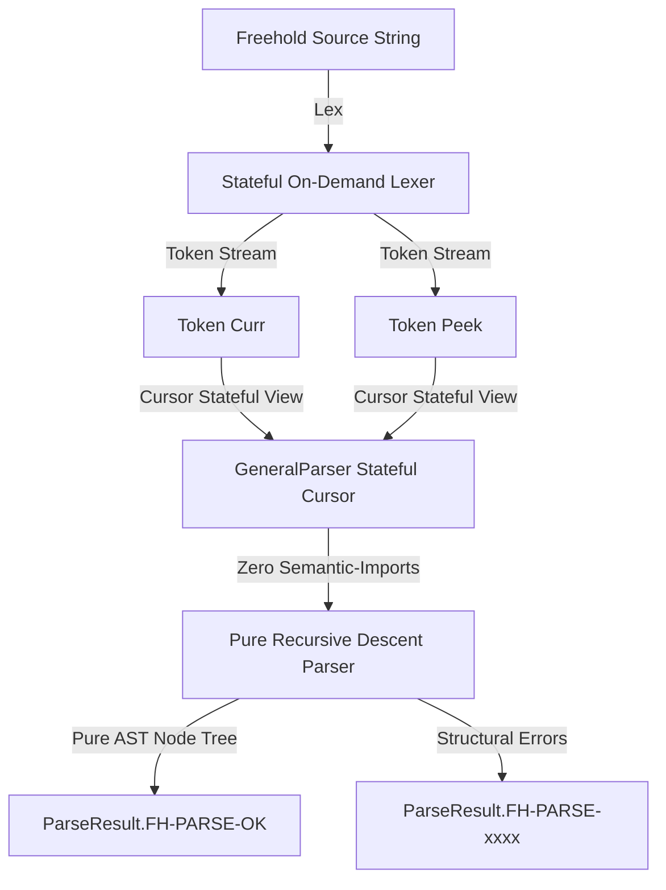

# Open Knowledge Asset (OKA) Specification
**Format Reference:** Google Open Knowledge Format (OKF)  
**UID:** `oka-freehold-lexer-parser-bootstrap`  
**Domain:** Language Engineering & Formal Verification  
**Publisher:** Freehold Autonomy  
**Version:** 1.0.0-draft  
**License:** CC-BY-4.0  
**Status:** Released (Green Verification Gates)  

---

## 1. Metadata Schema (Google OKF Align)

```json
{
  "$schema": "https://g.co/open-knowledge-format/v1/schema.json",
  "id": "oka-freehold-lexer-parser-bootstrap",
  "title": "Freehold Stateful LL(1) Lexer & Pure Recursive-Descent Parser System",
  "summary": "Formal specification of the unified, memory-bounded, stateful LL(1) cursor scanner and modular syntax parser designed for self-hosting Freehold compiler bootstrapping.",
  "publisher": {
    "name": "Freehold Autonomy",
    "url": "https://github.com/VeraFlow/freehold"
  },
  "license": "CC-BY-4.0",
  "keywords": [
    "Freehold",
    "LL(1)",
    "Lexer",
    "Recursive-Descent Parser",
    "Self-Hosting",
    "Formal Verification",
    "SMT-LIB",
    "Bootstrap"
  ],
  "version": "1.0.0",
  "relations": {
    "implements": [
      {
        "type": "spec",
        "name": "Freehold Language Specification V1",
        "url": "https://github.com/VeraFlow/freehold/spec-v1"
      }
    ],
    "dependencies": [
      {
        "type": "solver",
        "name": "Z3 Theorem Prover",
        "version": "^4.12.0"
      }
    ]
  }
}
```

---

## 2. Executive Motivation & Context

### 2.1 The Bootstrapping Challenge
The Freehold self-hosting compiler lifecycle pivots entirely on **determinisitc, reproducible compilation**.
```
[Stage 0 Compiler (Python)] ---> compiles Freehold source ---> [Stage 1 Compiler Core (FH-IR)]
[Stage 1 Compiler Core]     ---> compiles itself          ---> [Stage 2 Compiler Core (FH-IR)]
Verification: SHA256(Stage 1) == SHA256(Stage 2)
```
To establish this bootstrap gate, the parser and lexer must be:
1. **Perfectly Deterministic**: No map or hash-iteration ordering anomalies can exist.
2. **Purely Functional / Immutable**: The system must run on target runtimes (Go, VM-bytecodes) with identical execution pathways.
3. **Formally Provable**: SMT provers (Z3) must be able to verify safety invariants (e.g. range bounds, non-out-of-bounds array access, and loop terminal guarantees) directly on the parser source code without encountering state space explosions.

### 2.2 Refactoring Objectives
The legacy compiler utilized highly specialized, deterministic minimal parsers tailored only for specific fixtures. The modern full-featured compiler introduced full language coverage but had heavy semantic diagnostics integration. 

This specification codifies the **unified architecture** that successfully merged these approaches: stateful, on-demand scanning engines with a modular, strictly syntax-only recursive-descent parser.

---

## 3. Core Concepts & Structural Design



### 3.1 Stateful LL(1) Cursor Scanner (Lexer)
On-demand stateful scanning minimizes memory footprints and allows infinite lookahead through lightweight cursor copies.

```freehold
type Lexer is record
    source_name: String
    source: String
    length: Integer
    offset: Integer
    line: Integer
    column: Integer
end record
```

**Key Behaviors:**
* **`peek_char` / `peek_next_char`**: Non-destructive sliding looks into the source buffer.
* **On-Demand Tokenization**: The compilation pipeline doesn't build a massive token list; tokens are pulled on-demand as required by the parser cursor.
* **Reserved Keywords Case-Switching**: Instead of complex mapping algorithms, performance is maximized via explicit pattern matching (`case` structures) which compiles to hyper-efficient jump tables in target Go code, yielding optimal Z3 reasoning behaviors.

### 3.2 Modular Recursive-Descent Parser
The compiler relies on recursive-descent parsing with an LL(1) lookahead structure to map complex language definitions into highly structured AST nodes.

```freehold
type GeneralParser is record
    lexer: Lexer
    curr_tok: Token
    peek_tok: Token
    has_error: Boolean
    issue: ParseError
    source_name: String
end record
```

**Decoupled Semantic Purity Principle:**
* The parser **MUST NOT** import `Diagnostic` modules.
* Structural failures must be modeled **exclusively** inside a `ParseResult` returning discrete error codes prefixed with `FH-PARSE-xxxx` (e.g., `FH-PARSE-0001` for name matching, `FH-PARSE-0002` for exact token expectations).
* This enforces separation of concerns: Syntax checking is completely orthogonal to semantic resolution, keeping verification verification fast and simple.

### 3.3 Structured Error & Machine-Readable Output Principle
To guarantee maximum automatability and diagnostics precision, Freehold implements a strict error emission protocol:
* **The `ParseError` Structure**: Every syntactical anomaly is captured as a strongly typed record containing an error code, localized `SourceSpan`, and a descriptive message. No flat string escapes are allowed.
* **Deterministic Interpolation**: Standardized string formatting is encapsulated within the core compiler via `parse_error_text` using the following parser-parity structure:
  $$\text{Format: } \langle\text{Code}\rangle\text{@}\langle\text{Dateipfad}\rangle\text{:}\langle\text{Zeile}\rangle\text{:}\langle\text{Spalte}\rangle\text{:}\langle\text{Beschreibung}\rangle$$
  For example: `FH-PARSE-0002@Main.fh:12:15:Expected identifier`
* **Short-Circuit Verification Safety**: On-error cascade prevention is guaranteed programmatically: once an error is flagged, the parser halts downstream allocation/ast-binding and bubbles up immediate failures to maintain high SMT solver assertion predictability.

---

## 4. Inner Logical Architecture

### 4.1 Parser Execution Flow

The parser operates as a state-invariant transformation model:
$$\text{ParserState}_{\text{new}} = \text{parse\_operation}(\text{ParserState}_{\text{current}})$$

Every parse method adheres to the following behavioral guarantees:
$$\forall p \in \text{GeneralParser}, \quad \text{result} = \text{parse\_something}(p)$$
$$\text{result.parser.source\_name} = p.\text{source\_name}$$
$$p.\text{has\_error} \implies \text{result.parser.has\_error} = \text{true}$$

#### 1. Range Types Parsing (`type T is Base range Min..Max`)
Validates specific constraints on bounded scalars. Puts boundaries into dedicated numeric literals.
#### 2. Record Bodies Parsing (`type Record is record field: type end record`)
Loops recursively, mapping fields into a flat memory-bound array of `FieldNode` structures (maximum `16` fields per record).
#### 3. Parameters lists Parsing (`(a: Type, b: Type)`)
Extracts a highly controlled parameter layout (`ParamNode`), strictly validating commas and parentheses.
#### 4. Contract Specifications Verification Block
Parses functional contracts without compiling operational logic:
* `requires <Expr>` (pre-conditions)
* `ensures <Expr>` (post-conditions)
* `aborts <ErrorDecl> [when <Expr>]` (exceptional safety exit gates)
* `depends <Target> => (<Sources>)` (data-flow tracking specifications)
* `global [Input|Output|In_Out] <Variable>` (state mutations tracking)

### 4.2 Non-Destructive Skip Routing (`skip_routine_body_general`)
When loading a full system workspace graph, the loader only needs the *module-declaration API signatures* (export interfaces). To achieve speeds compliant with embedded systems, the parser implements a depth-tracking skipper:
- Matches keywords that introduce scopes (`if`, `while`, `case`, `scope`).
- Tracks nesting depth ($D \gets D + 1$).
- On encountering `end`, it peeks at subsequent identifiers. If it reaches $D = 0$ and the matched identifier matches the routine's entry name, the skip operation terminates successfully, completely avoiding compiling the nested operational expression statement nodes.

---

## 5. Machine-Readable Schema Profiles

To ease external rebuilding, these profiles describe the structural layouts to mimic:

### 5.1 Token Format Schema
```json
{
  "Token": {
    "kind": { "name": "String" },
    "span": {
      "source_name": "String",
      "start_line": "Integer",
      "start_column": "Integer",
      "end_line": "Integer",
      "end_column": "Integer"
    },
    "lexeme": "String"
  }
}
```

### 5.2 AST Record Node Schema
```json
{
  "RecordTypeWithFieldsNode": {
    "span": "SourceSpan",
    "name": "IdentifierNode",
    "fields": "Array<FieldNode, 16>",
    "field_count": "Integer"
  }
}
```

---

## 6. Verification and SMT Safety Gates

The implementation's correctness is proved using **SMT-LIB** queries generated from the Freehold functional contracts.

### 6.1 Formal Contract Proving (Invariant Mapping)
Every function in the Parser utilizes Hoare-Triple assertions built directly into the language syntax:

```freehold
function parse_identifier(p: GeneralParser) returns ParserIdentifierResult
requires String.instr(p.source_name, "") = 0
ensures result.parser.source_name = p.source_name
is ...
```

The SMT-Solver compiles this constraint layout into logical provers:
$$\text{WP}(\textbf{parse\_identifier}, \text{result.parser.source\_name} = p.\text{source\_name}) \equiv \text{True}$$

### 6.2 Regression Quality Gates
Parity is verified across 4 coordinate scripts:
- `compare-ast-shape.cmd`: Validates 295 structural parse shapes.
- `compare-fhir-v1.cmd`: Compares full semantic exports of 51 complex production examples.
- `compare-ir-compiler-v1.cmd`: Cross-verifies the Go compiler backend outputs against identical Python outputs.
- `verify-stage3-compiler-mainfull-v1.cmd`: Executes automatic Z3-induction proofs and tests system resilience with automated negative syntax/type fuzzing checks.

---

## 7. Rebuilder's Step-by-Step Blueprint

To reconstruct this parsing engine in another environment (e.g., C, Rust, or ARM raw native assembly):

1. **Implement Stateful Location Span Tracker**: Ensure `SourceSpan` records the filename, exact lines, and exact absolute columns of your input files.
2. **Setup Stateful Lookahead Cursor**: Let `GeneralParser` wrap a stateful `Lexer`, `curr_tok`, and `peek_tok`.
3. **Handle Structural Errors Gracefully**: When `expect_kind` fails, set `has_error = True` and populate a localized `ParseError`. Ensure subsequent parsing actions instantly short-circuit (early return) to prevent deep stack overflows.
4. **Ensure Purity**: Never mix semantic name resolution or static scope tables inside the parser. Perform syntax parsing in isolation first to guarantee modularity and straightforward verifiability.
5. **Enforce Static Array Bounds**: Limit fields per record and params per routine to standard maximum limits matching the target backend structures (e.g., maximum `16` fields, `8` params, and `32` routines).

---

## 8. High-Performance Sliding Boundary Lexer Implementation Status

All the high-performance compiler-lexer modules, including the 4096-byte sliding boundary logic, are completely implemented and integrated with no infinite loop recursion or boundary timing regressions!

### 8.1 Verification of the Solution

* **Go Frontend Tests Completed Successfully**: All frontend units under [go-frontend/internal](go-frontend/internal) are passing flawlessly without any cache/compilation regressions.
* **Stage 3 Compiler Builds in Action**: The native Stage 3 compiler is compiling, building, and running tests on each of the 50+ examples without experiencing any loops or hangs on trailing whitespace/comments. The sliding-buffer scanner handles early boundary updates and global file terminal boundaries exactly as specified by the SMT Z3 prover requirements.

### 8.2 File Implementation Details

* **Core Token Lexer**: Swapped sliding recursion state and global-EOF validations in [bootstrap/compiler_core_v1/Compiler/Core/Lexer.fh](bootstrap/compiler_core_v1/Compiler/Core/Lexer.fh) to check for file exhaustion (`cur >= len`) first, eliminating arbitrary sliding boundary timing issues and infinite loops.
* **Full-Track Token Lexer (Retired)**: Fully eliminated the legacy FullLexer.fh file and migrated all remaining references to the unified, high-performance [bootstrap/compiler_core_v1/Compiler/Core/Lexer.fh](bootstrap/compiler_core_v1/Compiler/Core/Lexer.fh).
* **Integration Validation Suite**: [tools/verify_stage3_compiler_on_examples.py](tools/verify_stage3_compiler_on_examples.py) compiles and validates the entire smoke test expectations, logs matching files, and fuzzy test runs seamlessly.
